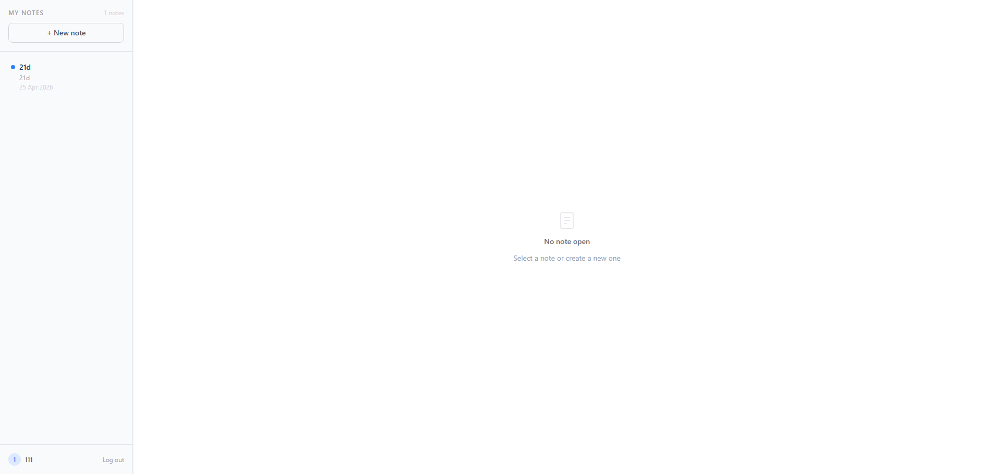
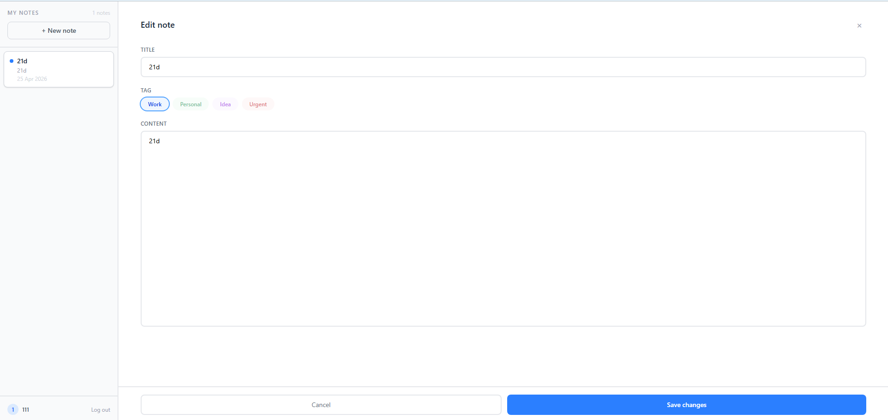
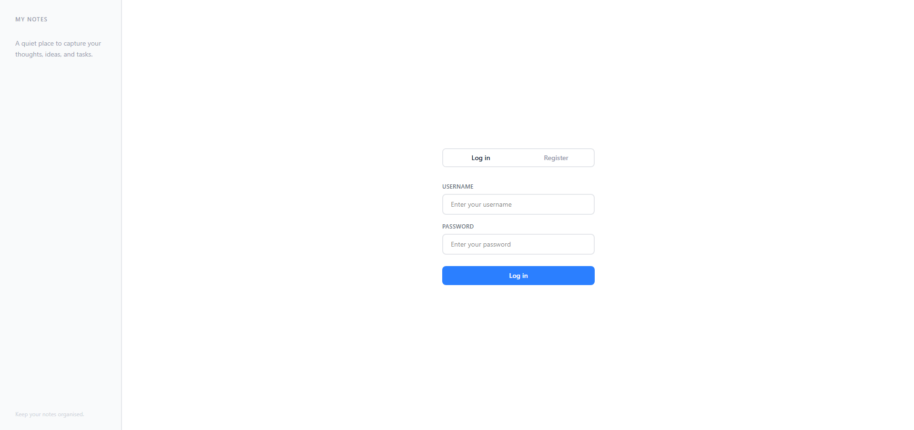

# Notess 📝

A clean and simple notes web app built with the MERN stack.

## Features

- **Create, edit, and delete notes** — full CRUD functionality
- **Tags** — organize notes by category: `Work`, `Personal`, `Idea`, or `Urgent`
- **Date created** — each note displays when it was made

## Live Demo

Try the project live here:
[Notess App](https://notess-jeraychs-projects.vercel.app/)

## Screenshots

### Home



### Note Form



### Login/Register



## Tech Stack

**Frontend**

- React (built with Vite)

**Backend**

- Node.js
- Express
- MongoDB

## Getting Started

### Prerequisites

- Node.js
- Docker & Docker Compose (handles MongoDB automatically)

### Installation

1. Clone the repository

```bash
git clone https://github.com/your-username/notess.git
cd notess
```

2. Install all dependencies from the root

```bash
npm run install:all
```

3. Create a `.env` file in the `backend` directory using the provided template

```bash
cp backend/.env.example backend/.env
```

The default values work out of the box for local development:

```env
MONGO_URI=mongodb://localhost:27017/notesdb
PORT=5000
JWT_SECRET=random
CORS_ORIGIN=http://localhost:5173
```

4. Create a `.env` file in the `frontend` directory using the provided template

```bash
cp frontend/.env.example frontend/.env
```

The default values work out of the box for local development:

```env
VITE_API_URL=http://localhost:5000
```

5. Start MongoDB with Docker

```bash
docker compose up -d
```

6. Run the app

```bash
npm run dev
```

The app will be running at `http://localhost:5173`

## License

This project is licensed under the [MIT License](LICENSE.txt).
